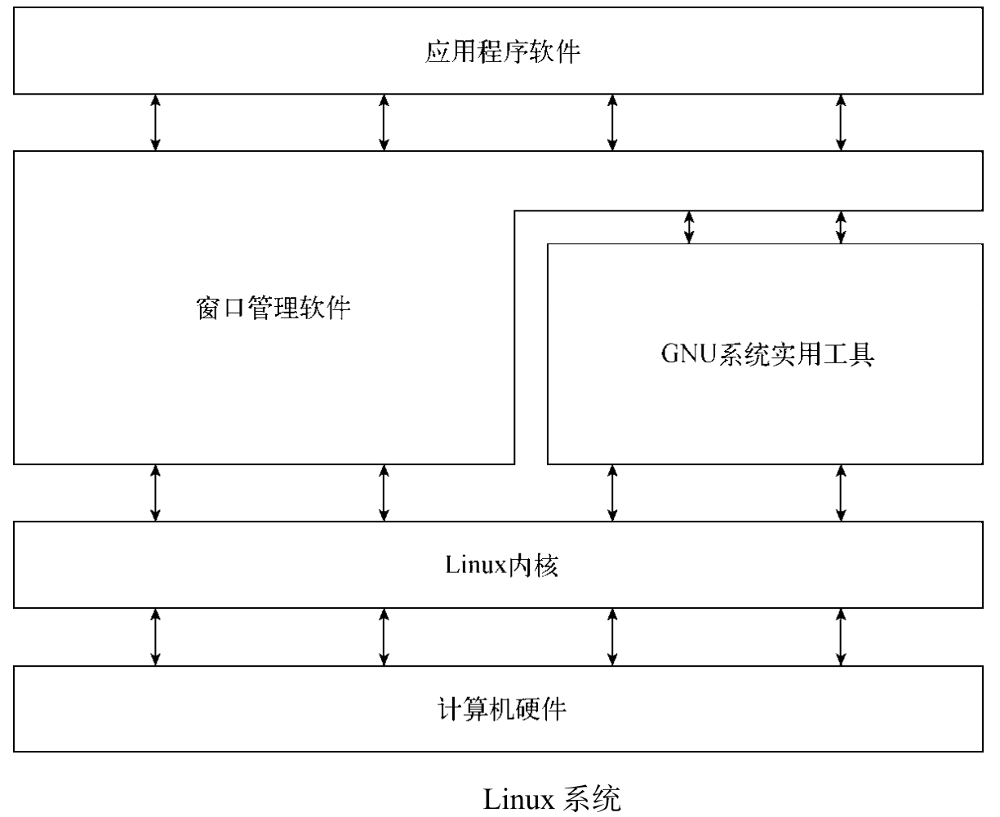
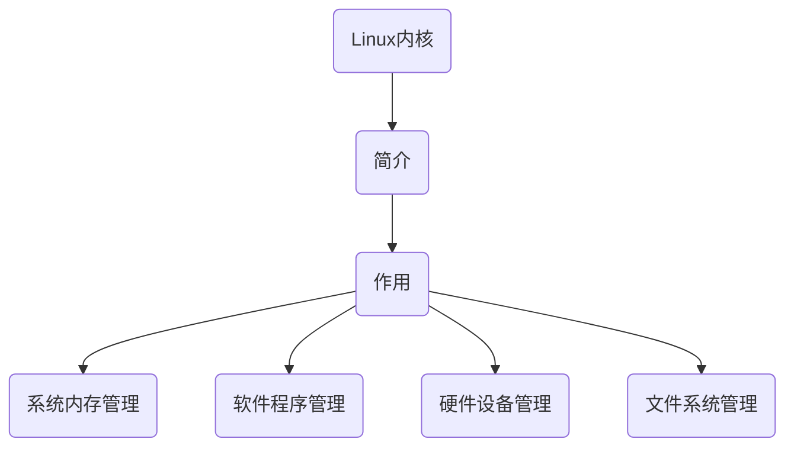
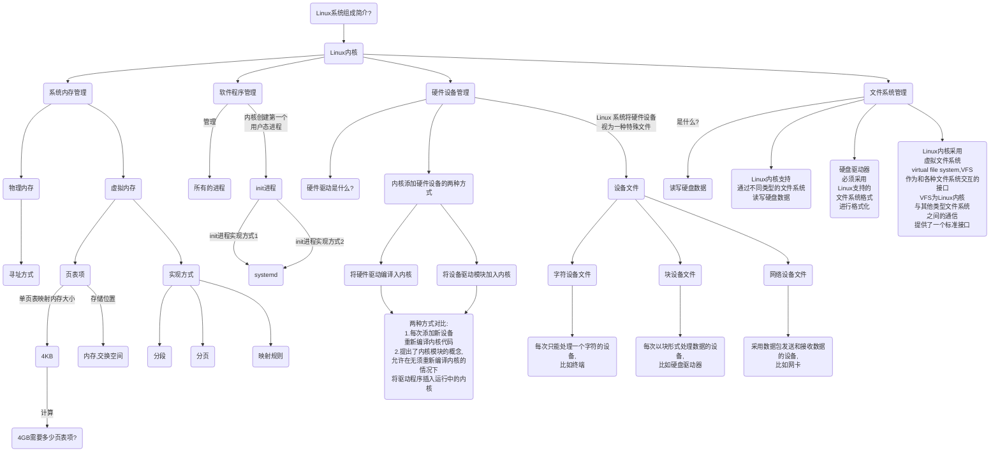
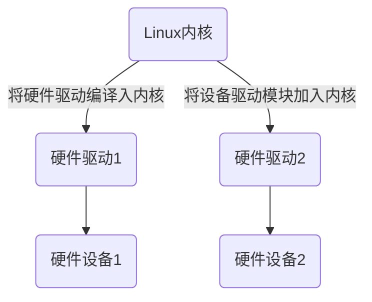
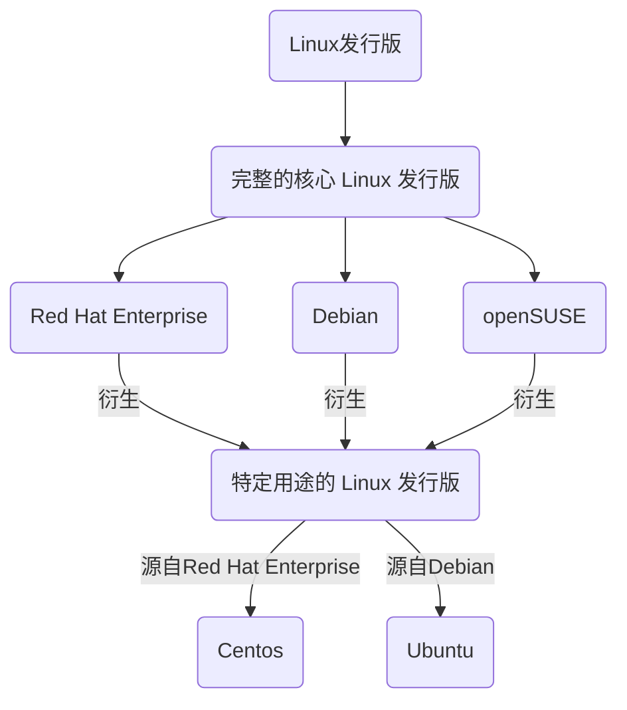
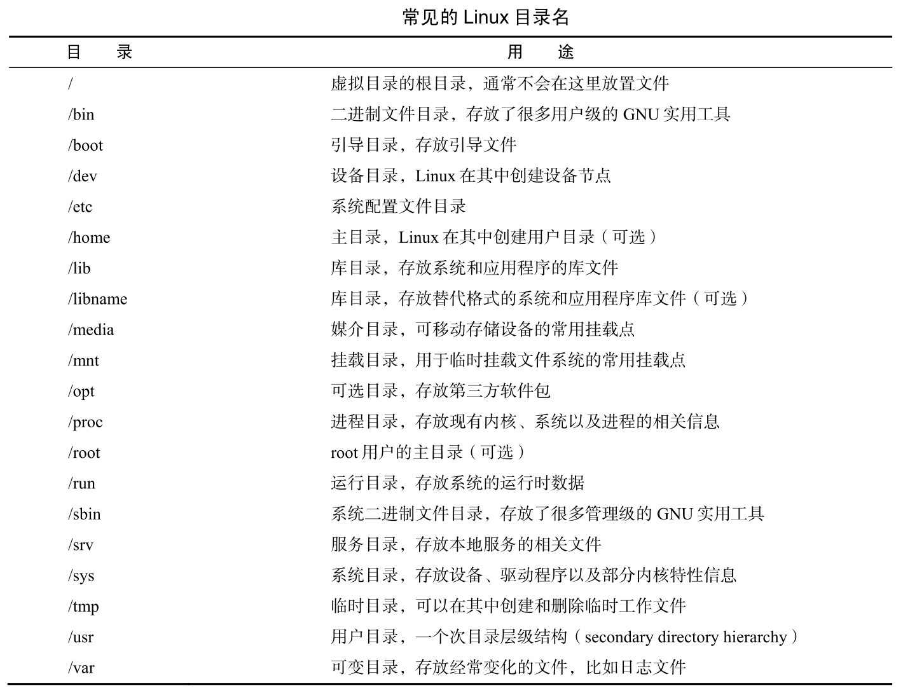

# <center>一、 Linux系统组成简介?

&emsp;&emsp;各部分彼此写作，构成整个Linux系统



## 1.1 Linux内核简介？

概览图



思维风暴



1. 简介：Linux系统的核心是内核。内核控制着计算机系统的所有硬件和软件，在必要时分配硬件，
   并根据需要执行软件

2. 作用
    1. 系统内存管理
    2. 软件程序管理
    3. 硬件设备管理
    4. 文件系统管理

### 1.1.1 Linux系统内存管理

1. 内核不仅管理服务器上的可用物理内存，还可以创建并管理虚拟内存
2. 内核为了隔离不同的进程，为每个进程分配了一套虚拟内存，虚拟内存用页表项的方式来实现，页表项存储在内存或者交换空间中
3. 内核负责虚拟内存到物理内存的映射

### 1.1.4. 32位系统采用一级页表方式需要多少个？

1. 32位系统一个页表项可寻址内存大小为4KB，如果要覆盖4GB内存，则需要4GB/4KB=2^20个页表项
2. 4KB指的是4096B，也就是4096个字节，4GB指的是4*1024*1024*1024B
3. 操作系统是按字节寻址，不是按位寻址

### 1.1.5. Linux软件程序管理

1. Linux操作系统称运行中的程序为进程。进程可以在前台运行，也可以在后台运行
2. 内核创建第一个进程是init进程用于启动系统中所有其他进程，内核控制着运行在系统中的所有进程。

### 1.1.6. 什么是init进程？

1. init进程是内核创建的第一个用户态进程，用于启动系统中所有其他进程

### 1.1.7. 什么是SysVinit和Systemd?

1. init进程的一种实现

### 1.1.8. Linux硬件设备管理

1. 将硬件通过驱动加入内核的两种方法



2. Linux 系统将硬件设备视为一种特殊文件，称为设备文件
    1. 字符设备文件
    2. 块设备文件
    3. 网络设备文件

### 1.1.9. 什么是字符设备文件？

1. 字符设备文件对应于每次只能处理一个字符的设备
2. 比如终端

### 1.1.10. 什么是块设备文件？

1. 块设备文件对应于每次以块形式处理数据的设备
2. 比如硬盘驱动器

<p align="center">Copyright © [2023/8/23 17:46] [gainovel]. All rights reserved.</p>

## 1.2 GUN实用工具

1. GNU 代表 GNU’s Not Unix，一个开发开源软件的组织
2. 开发出了一套完整的 Unix 实用工具
3. Linux 内核和 GNU 实用工具的结合体称为 Linux
4. GNU 项目旨在为 Unix 系统管理员打造出一套可用的类 Unix 环境。这个目标促使该项目移植了很多常见的 Unix 系统命令行工具
5. 供 Linux 系统使用的这组核心工具被称为 coreutils（core utilities）软件包

### 1.2.1 什么是开源软件？

1. 开源软件理念允许程序员开发软件并将其免费发布。
2. 所有人都可以使用、修改该软件，或将其集成进自己的系统，无须支付任何授权费用。

### 1.2.2 GNU coreutils 软件包组成？

1. 文件实用工具
2. 文本实用工具
3. 进程实用工具

### 1.2.3 什么是shell?

1. shell 是一种特殊的交互式工具，为用户提供了启动程序、管理文件系统中的文件以及运行在 Linux 系统中的进程的途径
2. shell 包含一组内部命令，可用于完成复制文件、移动文件、重命名文件、显示和终止系统中正在运行的程序这类操作
3. 将多个 shell 命令放入文件中作为程序执行。这些文件称作shell脚本

## 1.3 Linux发行版

1. **完整的核心Linux发行版**含有内核、一个或多个图形化桌面环境以及预编译好的大部分可用的Linux应用程序。它提供了一站式的完整
   Linux安装。
2. **特定用途的Linux发行版**通常基于某个主流发行版，但仅包含其中一部分用于某种特定用途的应用程序



## 1.4 Linux命令

Linux目录结构



### 1.4.1 目录和文件相关命令

#### 1.4.1.1 ls

```bash
alias lf="ls -AlthF --time-style '+%Y/%m/%d %H:%M:%S' --color=auto"
options:
-A  列出所有文件，包含隐藏文件
-l  列出文件详细信息
-t  按照文件修改时间进行排序
-h  文件大小方便查看
--time-style 时间现实的格式，一般年月日时分秒都加上
-R  递归显示文件
-F  帮助分辨文件类型，目录后面有/，文件后面没有/
-i  打印inode
tips:
ls 命令支持正则匹配，eg. ls my* 会列出当前文件夹下以my开头的目录或文件
```

#### 1.4.1.2 ln

https://zhuanlan.zhihu.com/p/455508513

https://blog.csdn.net/hejinjing_tom_com/article/details/78809662

```bash
ln -s TARGET LINK_NAME //软连接，相当于创建快捷方式
ln TARGET LINK_NAME //硬链接，其实是同一个文件
```

#### 1.4.1.3 file

探测文件的内部并判断文件类型

```bash
$ file test.txt
test.txt: ASCII text
$ file /bin
/bin: directory
$file /bin/ls
/bin/ls: ELF 64-bit LSB shared object, x86-64, version 1 (SYSV), dynamically linked, interpreter /lib64/ld-linux-x86-64.so.2, for GNU/Linux 3.2.0, BuildID[sha1]=9567f9a28e66f4d7ec4baf31cfbf68d0410f0ae6, stripped
```

#### 1.4.1.4 more,less,tail,head

```bash
tail -n 10 test.txt 查看test.txt尾部10行
head -n 10 test.txt 查看test.txt头部10行
tail -f test.txt 实时查看test.txt
```

### 1.4.2 进程相关命令

#### 1.4.2.1 ps

```bash
ps -auxf | grep 进程名
```
