# 一、 常见数据结构的实现原理

## 1.1 管道

### 1.1.1 WHAT-作用

1. Go提供的协程间的通信方式

### 1.1.1 WHAT-特点

```go
// 程序示例：unittesting/goexpertprogramming/chapter1/chan_test.go
// 通过chan的特点可以协调协程的运行
```

1. nil chan：读写nil管道均会导致进程退出，表现为`fatal error: all goroutines are asleep - deadlock!`
2. 关闭的chan：仍然可以读取数据，向关闭的管道中写数据会触发panic
3. chan的阻塞：从空chan中读数据和向满chan中写数据会阻塞协程
4. len()和cap()：内置函数len()和cap()分别用于查询管道缓存中数据的个数及缓存的大小
5. 读写管道：send-only type chan（`var ch chan<- int = make(chan int, 1)`）；receive-only type
   chan（`var ch <-chan int = make(chan int, 1)`）；send-and-receive type chan（`var ch = make(chan int, 2)`）
6. val,ok模式：val表示读到的数据，ok表示是否成功读取了数据

### 1.1.2 WHY-chan的实现原理

```go
// 源码包src/runtime/chan.go:hchan
type hchan struct{...}
```

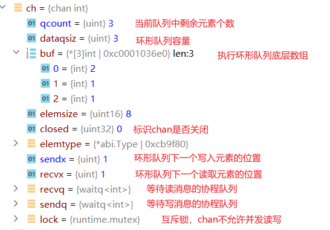

1. sendx和recvx依照环形队列底层数组的下标不断循环
2. 协程向chan写数据时，chan缓冲区满或没缓冲区，协程阻塞并加入sendq
3. 协程从chan读数据时，chan为空或没有缓存区，协程阻塞并加入sendq
4. 处于等待队列中的协程会在其他协程操作管道时被唤醒

### 1.1.3 HOW-如何判断一个管道已经关闭

1. val,ok模式：val表示读到的数据，ok表示是否成功读取了数据
2. ok为true对应两种情况：①chan未关闭②chan 关闭，缓存区还有数据
3. 耗尽chan中的数据，如果ok为false，代表chan关闭了
4. 一般不去判断chan是否关闭，而是结合context和select

### 1.1.4 HOW-操作chan触发panic的情况

1. 关闭nil chan： `---panic: close of nil channel`
2. 关闭已关闭的chan： `---panic: close of closed channel`
3. 向已经关闭的chan中写数据： `---panic: send on closed channel`

### 1.1.5 WAHT-chan close原则

1. 永远不要尝试在读取端关闭chan，写入端无法知道chan是否已经关闭，往已关闭的chan写数据会panic
2. 一个写入端，在这个写入端可以放心关闭channel
3. 多个写入端时，不要在写入端关闭 channel，其他写入端无法知道 chan是否已经关闭，关闭已经关闭的chan会发生panic
   永远只允许一个 goroutine（比如，只用来执行关闭操作的一个 goroutine ）执行关闭操作；
4. chan作为函数参数的时候，最好带方向

### 1.1.6 HOW-安全使用chan？

1. 遵守一定的chan使用原则，杜绝会引起panic的操作：①关闭nil chan②关闭已关闭的chan③向已经关闭的chan中写数据
2. ③解决；通过context来配合使用，我们可以通过一个ctx变量来指明close事件，ctx.Done() 事件发生之后，我们就明确不写数据到
   channel

### 1.1.7 HOW-怎么优雅关闭chan？

1. panic-recover：关闭一个chan直接调用close即可，但是关闭一个已经关闭的chan会导致 panic，怎么办？panic-recover 配合使用即可。

```go
func SafeClose(ch chan int) (closed bool) {
defer func () {
if recover() != nil {
closed = false
}
}()
// 如果 ch 是一个已经关闭的，会 panic 的，然后被 recover 捕捉到；
close(ch)
return true
}
```

2. sync.Once：可以使用 sync.Once 来确保 close 只执行一次。

```go
type ChanMgr struct {
C    chan int
once sync.Once
}
func NewChanMgr() *ChanMgr {
return &ChanMgr{C: make(chan int)}
}
func (cm *ChanMgr) SafeClose() {
cm.once.Do(func () { close(cm.C) })
}
```

3. 专门一个协程执行关闭操作，context做事件同步，先停止写chan，再关闭chan

```go
package main

import (
	"context"
	"sync"
	"time"
)

func main() {
	// channel 初始化
	c := make(chan int, 10)
	// 用来 recevivers 同步事件的
	wg := sync.WaitGroup{}
	// 上下文
	ctx, cancel := context.WithCancel(context.TODO())

	// 专门关闭的协程
	go func() {
		time.Sleep(2 * time.Second)
		cancel()
		// ... 某种条件下，关闭 channel
		close(c)
	}()

	// senders（写端）
	for i := 0; i < 10; i++ {
		go func(ctx context.Context, id int) {
			select {
			case <-ctx.Done():
				return
			case c <- id: // 入队
				// ...
			}
		}(ctx, i)
	}

	// receivers（读端）
	for i := 0; i < 10; i++ {
		wg.Add(1)
		go func() {
			defer wg.Done()
			// ... 处理 channel 里的数据
			for v := range c {
				_ = v
			}
		}()
	}
	// 等待所有的 receivers 完成；
	wg.Wait()
}

```

### 1.1.8 HOW-select监控chan

1. 使用select可以监控多个管道，当其中某一个管道可操作时就触发相应的case分支。
2. select语句的多个case语句的执行顺序是随机的

### 1.1.9 HOW-for range从chan中读数据

1. for-range可以持续地从管道中读出数据，好像在遍历一个数组一样
2. 当管道中没有数据时会阻塞当前协程
3. chan closed,for-range也可以正常结束

## 1.2 slice

slice又称动态数组，依托数组实现，可以方便地进行扩容和传递

### 1.2.1 HOW-slice声明和初始化

```go
// 声明
var s []int
// 初始化
s1 := []int{1, 2, 3}
s2 := make([]int, 12)
var s3 = []int{1, 2, 3}
var s4 = make([]int,12)
s5 := s1[1:2]
```

### 1.2.2 WHY-实现原理

```go
type slice struct {
array unsafe.Pointer
len   int
cap   int
}
```

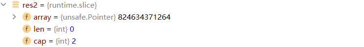

### 1.2.3 WHY-扩容规则

1. 确定预估容量
   go1.21 src

```go
newcap := oldCap
doublecap := newcap + newcap
if newLen > doublecap {
newcap = newLen
} else {
const threshold = 256
if oldCap < threshold {
newcap = doublecap
} else {
// Check 0 < newcap to detect overflow
// and prevent an infinite loop.
for 0 < newcap && newcap < newLen {
// Transition from growing 2x for small slices
// to growing 1.25x for large slices. This formula
// gives a smooth-ish transition between the two.
newcap += (newcap + 3*threshold) / 4
}
// Set newcap to the requested cap when
// the newcap calculation overflowed.
if newcap <= 0 {
newcap = newLen
}
}
}
```

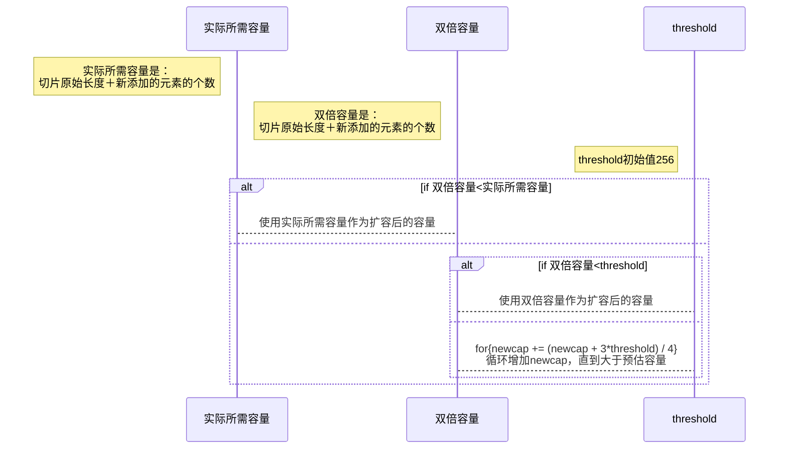

2. 调用go内存管理模块申请内存
    1. 内存管理模块。它会提前向操作系统申请一批内存；分成常用的规格管理起来，我们申请内存时，它会帮我们匹配到足够大、且最接近的规格
    2. 常用的规格有8，16，32，48，64，...
    3. 预估申请内存大小=预估容量(元素个数)*元素类型占用内存大小
    4. go调用内存管理模块选定一块合适大小的内存进行分配
    5. eg. int类型的切片，预估容量为6，每个元素占4个字节，因此需要24字节大小的内存，因此内存管理模块会分配一块32字节大小的内存供程序使用

### 1.2.3 WHY-为什么这么扩容？

为了slice的性能和空间使用率之前的平衡

1. 当切片较小时，采用较大的扩容倍速，可以避免频繁地扩容，从而减少内存分配的次
   数和数据拷贝的代价；
2. 当切片较大时，采用较小的扩容倍速，主要是为了避免浪费空间。

### 1.2.3 HOW-slice如何拷贝？

1. 使用copy()内置函数拷贝两个切片时，会将源切片的数据逐个拷贝到目的切片指向的数组
   中，拷贝数量取两个切片长度的最小值。

### 1.2.4 HOW-切片使用建议

1. 使用append()向切片追加元素时有可能触发扩容，扩容后会生成新的切片，对新切片的修改与原切片无关了
2. 创建切片时可根据实际需要预分配容量，尽量避免在追加过程中的扩容操作，有利于提升性能；
3. 切片拷贝时需要判断实际拷贝的元素个数；
4. 谨慎使用多个切片操作同一个数组，以防读写冲突。

## 1.3 map

Go语言的map底层使用hash表实现

### 1.3.1 HOW-map声明和初始化

```go
// map声明
var map1 map[string]int // map1 == nl
// map初始化
//1
map1 := map[string]int{
{"apple":2},
{"banana":3},
}
//2
map2 := make(map[string]int)
map2["apple"] = 2

```

### 1.3.2 WHAT-map特点

1. 向值为nil的map添加元素时会触发panic。---panic: assignment to entry in nil map
2. 查询时，如果键不存在，不会报错，返回值类型的零值
3. map为nil或者键不存在，查询和删除`delete(map1, "apple")`不报错
4. 使用val,ok形式查询map，ok为false，表示元素不存在
5. map不支持并发读写，多个协同同时操作map会fatal ---fatal error: concurrent map writes

### 1.3.3 HOW-map使用建议

1. 初始化map时推荐使用内置函数make()并指定预估的容量
2. 修改键值对时，需要先判断map是否为nil，否则会触发panic
3. 查询键值对时，最好检查键是否存在，避免操作零值。
4. 避免并发读写map，如果需要并发读写，则可以使用额外的锁（互斥锁、读写锁），也可以考虑使用标准库sync包中的sync.Map

### 1.3.4 WHY-map实现原理

**map的数据结构**

```go
type hmap struct {
count     int //已经存储的键值对个数
flags     uint8
B         uint8 // 常规桶个数等于2^B
noverflow uint16          // 使用的溢出桶数量
hash0     uint32          // hash seed
buckets    unsafe.Pointer // 常规桶起始地址
oldbuckets unsafe.Pointer // 扩容时保存原来常规桶的地址
nevacuate  uintptr        // 渐进式扩容时记录下一个要被迁移的旧桶编号

extra *mapextra
}

type bmap struct{
tophash[8]uint8
data []byte
overflow*bmap
}

type mapextra struct {
overflow    *[]*bmap //把已经用到的溢出桶链起来
oldoverflow *[]*bmap //渐进式扩容时，保存旧桶用到的溢出桶
nextOverflow *bmap   //下一个尚未使用的溢出桶
}

```

1. hmap中添加9个元素
   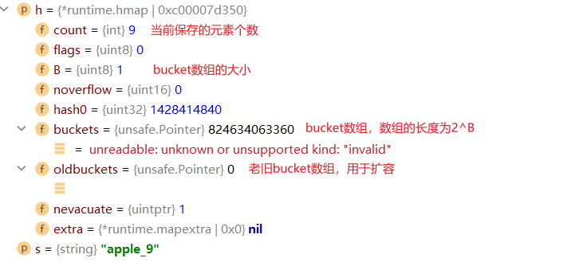
2. hmap中添加10000个元素
   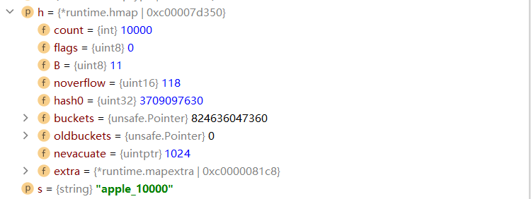
3. hmap结构图
   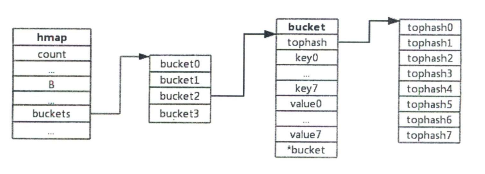
4. 预分配溢出桶
   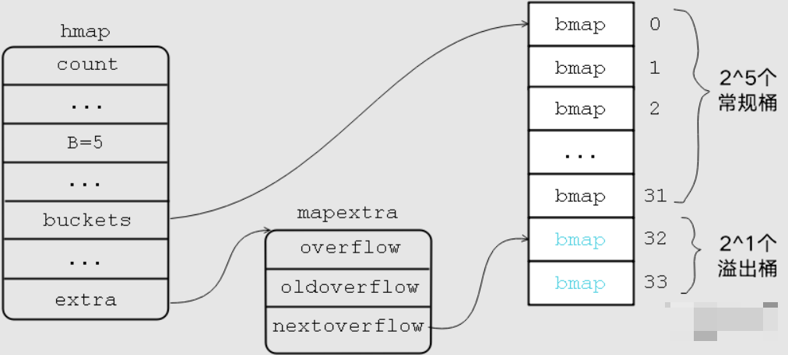
5. hash冲突占用溢出桶
   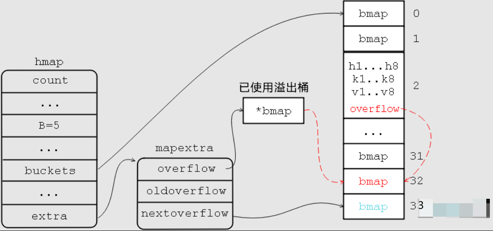
   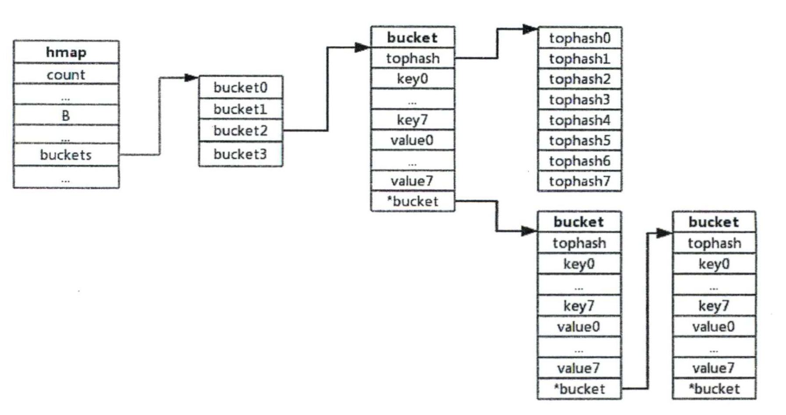
6. 翻倍扩容时hmap结构图
   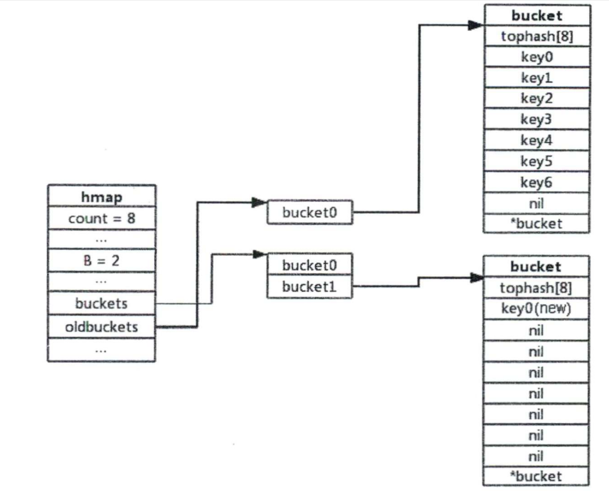
7. 翻倍扩容结束hmap结构图
   
8. 等量扩容时hmap结构
   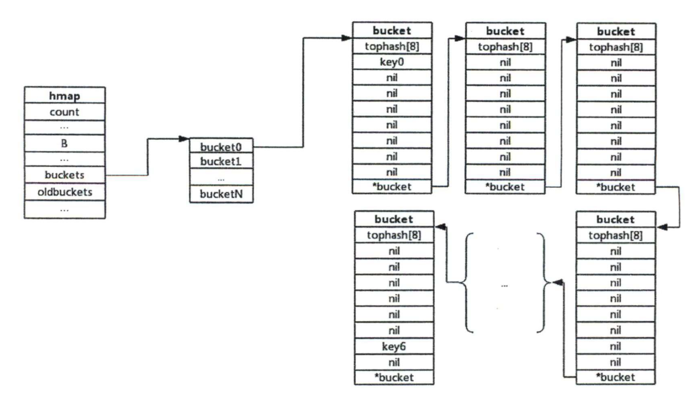

### 1.3.5 HOW-hash冲突怎么处理

### 1.3.6 HOW-翻倍扩容和等量扩容触发条件

### 1.3.7 HOW-翻倍扩容负载因子怎么计算？负载因子说明了什么？

### 1.3.8 HOW-翻倍扩容如何保证key均匀的散落到新桶中？

### 1.3.9 HOW-为什么要做等量扩容？

### 1.3.10 HOW-map增删改查的过程？

## 1.4 struct

Go语言的struct与其他编程语言的class有些类似，可以定义字段和方法，但是不可以继承

### 1.4.1 WHAT-内嵌字段

1. 对于类型为结构体的字段，显式指定时与其他类型没有区别，仅代表某种类型的字段，而隐式指定时，原结构体的字段和方法看起来就像是被“继承”过来了一样。
2. 当结构体cat中嵌入另一个结构体Animal时，相当于声明了一个名为Animal的字段,
   此时结构体Animal中的字段和方法会被提升到Cat中，看上去就像是Cat的原生字段和方法。

```go
type Animal struct {
Name string
}

func (a *Animal) SetName(name string) {
a.Name = name
}

type Cat struct {
Animal
}

type Dog struct {
a Animal
}
```

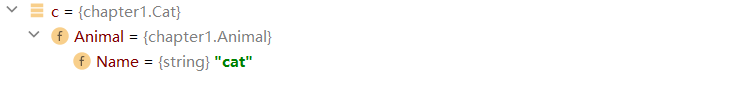

### 1.4.2 WHAT-结构体方法和方法接收者

1. 可以为结构体定义方法，此时结构体作为方法接收者
2. 此时可以把方法接收者看作方法的特殊参数
3. 接收者类型为结构体指针，相当于把指针传给了方法，对该接收者的修改直接作用到接收者本身；接收者类型为结构体，相当于传递了一份拷贝给方法，对该接收者的修改不会作用到结构体自身

### 1.4.3 WHAT-结构体字段标签

reflect包中，用StructField表示结构体的一个字段

```go
type StructField struct {
// Name is the field name.
Name string
// PkgPath is the package path that qualifies a lower case (unexported)
// field name. It is empty for upper case (exported) field names.
// See https://golang.org/ref/spec#Uniqueness_of_identifiers
PkgPath string
Type      Type // field type
Tag       StructTag // field tag string
Offset    uintptr   // offset within struct, in bytes
Index     []int     // index sequence for Type.FieldByIndex
Anonymous bool // is an embedded field
}
```

1. Tag 用于标识结构体字段的额外属性，有点类似于注释。标准库 reflect 包中提供了操作Tag 的方法
2. Tag本身是一个字符串，有一个约定的格式：key:"value"格式；key和value之间使用冒号分隔，冒号前后不能有空格，多个key:"value"之间由
   空格分开
3. key 一般表示用途，比如 json 表示用于控制结构体类型与 JSON 格式数据之间的转换，
   protobuf 表示用于控制序列化和反序列化。 value 一般表示控制指令，具体控制指令由不同
   的库指定

### 1.4.4 WHAT-如何获取tag?

```go
type TypeMeta struct {
Kind       string `json:"kind,omitempty" protobuf:"bytes,1,opt,name=kind"`
APIVersion string `json:"apiVersion,omitempty" protobuf:"bytes,2,opt,name=apiVersion"`
}

func PrintTag() {
t := TypeMeta{}
ty := reflect.TypeOf(t)

for i := 0; i < ty.NumField(); i++ {
fmt.Printf("Field: %s, Tag: %s\n", ty.Field(i).Name, ty.Field(i).Tag.Get("json"))
}
}
```

### 1.4.5 WHAT-tag的意义?

Go 语言的反射特性可以动态地给结构体成员赋值，正是因为有 Tag, 在赋值前可以使用Tag 来决定赋值的动作。

## 1.5 iota

### 1.5.1 WHAT-const和iota赋值规则

1. const下一行的值定义可以省略，省略后依据前一行的值定义赋值
2. iota代表了 const声明块的行索引（下标从0开始）
3. const+iota可以实现快速赋值

## 1.6 string

1. 值类型，值结构类似于[]byte
2. 值不可修改
3. string因为不可变，每次赋值都会新建一个string，设计到内存拷贝

### 1.6.1 HOW-声明和初始化

```go
// 声名
var s string
// 初始化
s1 := "hello"
```

### 1.6.2 WHAT-""和``的区别

1. `""`会对特殊字符进行转义，``不会对特殊字符进行转义

### 1.6.3 WHAT-字符串拼接

1. 字符串拼接时会触发内存分配及内存拷贝，单行语句拼接多个字符串只分配一次内存
2. 两次遍历：第一次遍历要拼接的所有字符串，计算总长度，据此申请内存；第二次遍历会把字符逐个拷过去
3. 字符串不可修改，因此新生成的字符串也不可修改；具体做法就是，使字符串和切片共享底层数组，通过切片将字符拷贝过去，进而生成新的字符串

### 1.6.4 HOW-[]byte和string之间互相转换

1. 无论是字符串转换成口byte,还是[]byte转换成string,都将发生一次内存拷贝，会有一定的开销
2. 编译优化：byte 切片转换成 string 的场景有很多，出于性能上的考虑，有时候只是应用在临时需要字符串的场景下。byte切片转换成string时并不会拷贝内存，而是直接返回一个string,
   这个string 的指针 (string.str) 指向切片的内存

```go
bytes1 := []byte{228, 184, 173, 229, 155, 189}//中国
runes1 := []rune{20013, 22269}//中国
fmt.Println(string(bytes1))
fmt.Println(string(runes1))
fmt.Println([]byte(string(bytes1)))
fmt.Println([]byte(string(runes1)))

```

### 1.6.5 WHY-实现原理

数据结构

```go
type stringStruct struct {
str unsafe.Pointer // 字符串的首地址
len int            // 字符串的长度
}

```

### 1.6.6 WHY-为什么string不能修改？

1. 在Go的实现中，string不包含内存空间，只有一个内存的指针，这样做的好处是string变得非常轻量，可以很方便地进行传递而不用担心内存拷贝。
2. 因为string通常指向字符串字面量，而字符串字面量存储的位置是只读段，而不是堆或栈上，所以才有了 string不可修改的约定

# 二、控制结构

## 2.1 select

1. select是Go在语言层面提供的多路I/O复用机制，用于检测多个管道是否就绪（即可读或可写），其特性跟管道息息相关

### 2.1.1 WHY-fatal error: all goroutines are asleep - deadlock!

1. 所有goroutine都阻塞了：因为go的runtime会检查你所有的goroutine都卡住了， 没有一个能执行，就会报改错
2. 死锁发生：①多个协程获取多个互斥锁②已经获得的锁协程自己不释放，别的协程也不可剥夺③多个协程循环等待锁

### 2.1.2 HOW-select使用举例

1. 永久阻塞

```go
func main(){
select{}
}
```

2. 快速检错
   将chan当作参数进行传递，将error写入chan，主协程通过chan快速检查错误的发生
3. 限时等待
   通过timer设定select的最长等待时间，最长等待时间到达还未从chan中获得数据，就执行超时相关操作

### 2.1.3 WHY-select实现原理

1. select中case语句对应scase数据结构

```go
type scase struct {
c    *hchan         // chan
elem unsafe.Pointer // data element
}
```

2. select中每个scase的类型

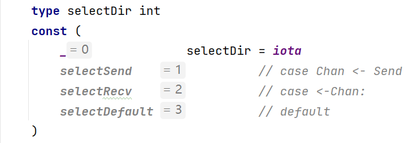

1. c为该scase可操作的管道，因此select中每个case有且必须有个管道操作，否则会给出编译错误
2. 每个case分支必然是读管道`selectSend`、写管道`selectRecv`或default`selectDefault`中的一种
3. default分支最多一个

3. elem表示从管道中读写的数据存放的地址
4. select随机选择就绪的case实现：所有的case分支都对应一个scase结构，将所有的case分支都放入一个数组，并打乱数组顺序，这样再从数组中取值，就可以达到随机选择一个case的效果

### 2.1.4 HOW-select使用小结

1. select仅能操作管道
2. 每个case语句只能处理一个管道，要么读要么写
3. 多个case语句的执行顺序是随机的
4. default分支最多一个，存在default分支select不会阻塞

## 2.2 for-range

1. range可作用于数组、切片、string、map、chan

### 2.2.1 WHY-实现原理

1. 编译器会将fbr-range语句处理成传统的for循环
2. 编译器会从for-range语句中提取出初始化语句(NT)、条件语句(COND)和迭代语句(POST)
3. 不同的类型细节上存在一些差异

**for range遍历数组**

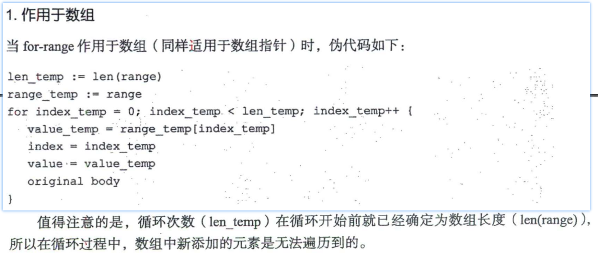

**for range遍历切片**

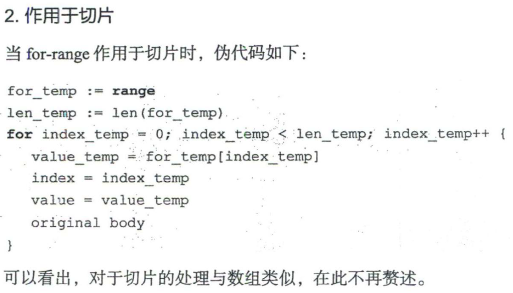

**for range遍历string**

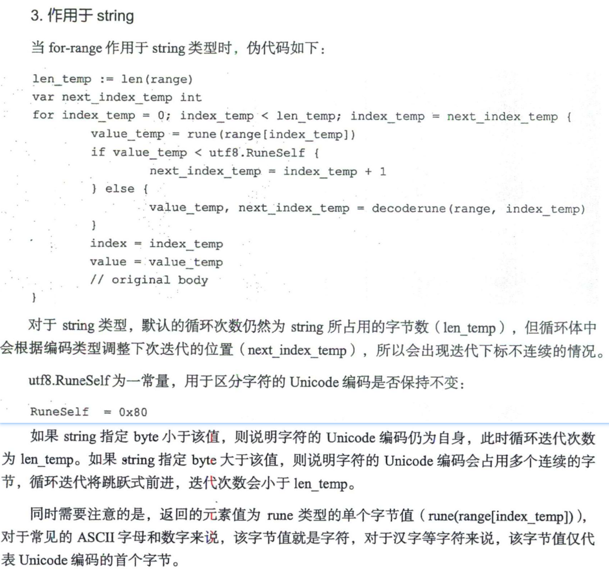

**for range遍历map**

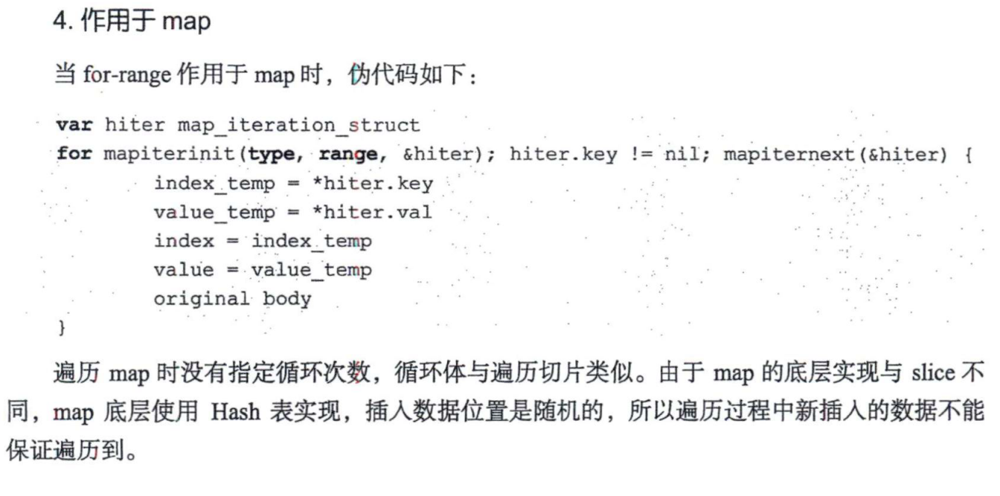

**for range遍历chan**

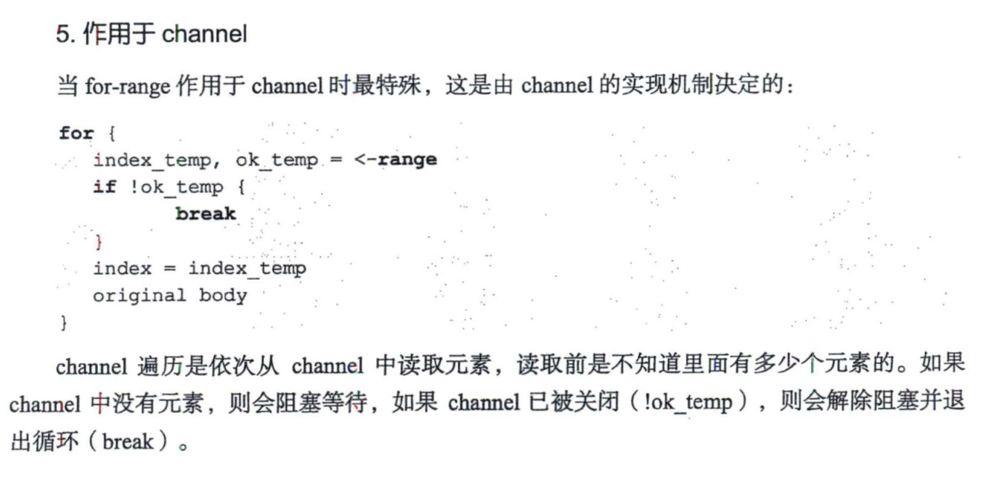

# 三、协程

## 3.1 WHAT-什么是进程？

1. 进程是应用程序的启动实例，每个进程都有独立的内存空间，不同进程通过进程间的通信方式来通信

## 3.2 WHAT-什么是线程？

1. 线程从属于进程，每个进程至少包含一个线程，线程是CPU调度的基本单位，多个线程之间可以共享进程的资源并通过共享内存等线程间的通信方式来通信。

## 3.2 WHAT-什么是协程？

1. 协程可理解为一种轻量级线程，与线程相比，协程不受操作系统调度，协程调度器由用户
   应用程序提供，协程调度器按照调度策略把协程调度到线程中运行。Go应用程序的协程调度
   器由runtime包提供，用户使用go关键字即可创建协程，这也就是在语言层面直接支持协程的
   含义。


