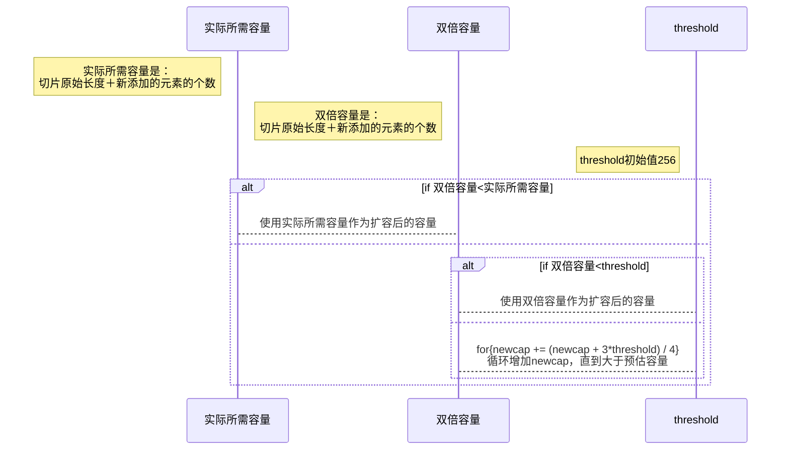

# 一、 常见数据结构的实现原理

## 1.1 管道

### 1.1.1 WHAT-作用

1. Go提供的协程间的通信方式

### 1.1.1 WHAT-特点

```go
// 程序示例：unittesting/goexpertprogramming/chapter1/chan_test.go
// 通过chan的特点可以协调协程的运行
```

1. nil chan：读写nil管道均会导致进程退出，表现为`fatal error: all goroutines are asleep - deadlock!`
2. 关闭的chan：仍然可以读取数据，向关闭的管道中写数据会触发panic
3. chan的阻塞：从空chan中读数据和向满chan中写数据会阻塞协程
4. len()和cap()：内置函数len()和cap()分别用于查询管道缓存中数据的个数及缓存的大小
5. 读写管道：send-only type chan（`var ch chan<- int = make(chan int, 1)`）；receive-only type
   chan（`var ch <-chan int = make(chan int, 1)`）；send-and-receive type chan（`var ch = make(chan int, 2)`）
6. val,ok模式：val表示读到的数据，ok表示是否成功读取了数据

### 1.1.2 WHY-chan的实现原理

```go
// 源码包src/runtime/chan.go:hchan
type hchan struct{...}
```


1. sendx和recvx依照环形队列底层数组的下标不断循环
2. 协程向chan写数据时，chan缓冲区满或没缓冲区，协程阻塞并加入sendq
3. 协程从chan读数据时，chan为空或没有缓存区，协程阻塞并加入sendq
4. 处于等待队列中的协程会在其他协程操作管道时被唤醒

### 1.1.3 HOW-如何判断一个管道已经关闭

1. val,ok模式：val表示读到的数据，ok表示是否成功读取了数据
2. ok为true对应两种情况：①chan未关闭②chan 关闭，缓存区还有数据
3. 耗尽chan中的数据，如果ok为false，代表chan关闭了
4. 一般不去判断chan是否关闭，而是结合context和select

### 1.1.4 HOW-操作chan触发panic的情况

1. 关闭nil chan： `---panic: close of nil channel`
2. 关闭已关闭的chan： `---panic: close of closed channel`
3. 向已经关闭的chan中写数据： `---panic: send on closed channel`

### 1.1.5 WAHT-chan close原则

1. 永远不要尝试在读取端关闭chan，写入端无法知道chan是否已经关闭，往已关闭的chan写数据会panic
2. 一个写入端，在这个写入端可以放心关闭channel
3. 多个写入端时，不要在写入端关闭 channel，其他写入端无法知道 chan是否已经关闭，关闭已经关闭的chan会发生panic
   永远只允许一个 goroutine（比如，只用来执行关闭操作的一个 goroutine ）执行关闭操作；
4. chan作为函数参数的时候，最好带方向

### 1.1.6 HOW-安全使用chan？

1. 遵守一定的chan使用原则，杜绝会引起panic的操作：①关闭nil chan②关闭已关闭的chan③向已经关闭的chan中写数据
2. ③解决；通过context来配合使用，我们可以通过一个ctx变量来指明close事件，ctx.Done() 事件发生之后，我们就明确不写数据到
   channel

### 1.1.7 HOW-怎么优雅关闭chan？

1. panic-recover：关闭一个chan直接调用close即可，但是关闭一个已经关闭的chan会导致 panic，怎么办？panic-recover 配合使用即可。

```go
func SafeClose(ch chan int) (closed bool) {
    defer func () {
        if recover() != nil {
            closed = false
        }
    }()
    // 如果 ch 是一个已经关闭的，会 panic 的，然后被 recover 捕捉到；
    close(ch)
    return true
}
```

2. sync.Once：可以使用 sync.Once 来确保 close 只执行一次。

```go
type ChanMgr struct {
    C    chan int
    once sync.Once
}
func NewChanMgr() *ChanMgr {
    return &ChanMgr{C: make(chan int)}
}
func (cm *ChanMgr) SafeClose() {
    cm.once.Do(func () { close(cm.C) })
}
```

3. 专门一个协程执行关闭操作，context做事件同步，先停止写chan，再关闭chan
```go
package main

import (
    "context"
    "sync"
    "time"
)

func main() {
    // channel 初始化
    c := make(chan int, 10)
    // 用来 recevivers 同步事件的
    wg := sync.WaitGroup{}
    // 上下文
    ctx, cancel := context.WithCancel(context.TODO())

    // 专门关闭的协程
    go func() {
        time.Sleep(2 * time.Second)
        cancel()
        // ... 某种条件下，关闭 channel
        close(c)
    }()

    // senders（写端）
    for i := 0; i < 10; i++ {
        go func(ctx context.Context, id int) {
            select {
                case <-ctx.Done():
                return
                case c <- id: // 入队
                // ...
            }
        }(ctx, i)
    }

    // receivers（读端）
    for i := 0; i < 10; i++ {
        wg.Add(1)
        go func() {
            defer wg.Done()
            // ... 处理 channel 里的数据
            for v := range c {
                _ = v
            }
        }()
    }
    // 等待所有的 receivers 完成；
    wg.Wait()
}

```

### 1.1.8 HOW-select监控chan

1. 使用select可以监控多个管道，当其中某一个管道可操作时就触发相应的case分支。
2. select语句的多个case语句的执行顺序是随机的

### 1.1.9 HOW-for range从chan中读数据

1. for-range可以持续地从管道中读出数据，好像在遍历一个数组一样
2. 当管道中没有数据时会阻塞当前协程
3. chan closed,for-range也可以正常结束

## 1.2 slice

slice又称动态数组，依托数组实现，可以方便地进行扩容和传递

### 1.2.1 HOW-slice声明和初始化

```go
// 声明
var s []int
// 初始化
s1 := []int{1, 2, 3}
s2 := make([]int, 12)
var s3 = []int{1, 2, 3}
var s4 = make([]int,12)
s5 := s1[1:2]
```

### 1.2.2 WHY-实现原理

```go
type slice struct {
    array unsafe.Pointer
    len   int
    cap   int
}
```

### 1.2.3 WHY-扩容规则

1. 确定预估容量
   go1.21 src

```go
newcap := oldCap
doublecap := newcap + newcap
if newLen > doublecap {
    newcap = newLen
} else {
    const threshold = 256
    if oldCap < threshold {
        newcap = doublecap
    } else {
        // Check 0 < newcap to detect overflow
        // and prevent an infinite loop.
        for 0 < newcap && newcap < newLen {
            // Transition from growing 2x for small slices
            // to growing 1.25x for large slices. This formula
            // gives a smooth-ish transition between the two.
            newcap += (newcap + 3*threshold) / 4
        }
        // Set newcap to the requested cap when
        // the newcap calculation overflowed.
        if newcap <= 0 {
            newcap = newLen
        }
    }
}
```



2. 调用go内存管理模块申请内存
    1. 内存管理模块。它会提前向操作系统申请一批内存；分成常用的规格管理起来，我们申请内存时，它会帮我们匹配到足够大、且最接近的规格
    2. 常用的规格有8，16，32，48，64，...
    3. 预估申请内存大小=预估容量(元素个数)*元素类型占用内存大小
    4. go调用内存管理模块选定一块合适大小的内存进行分配
    5. eg. int类型的切片，预估容量为6，每个元素占4个字节，因此需要24字节大小的内存，因此内存管理模块会分配一块32字节大小的内存供程序使用

### 1.2.3 WHY-为什么这么扩容？

为了slice的性能和空间使用率之前的平衡

1. 当切片较小时，采用较大的扩容倍速，可以避免频繁地扩容，从而减少内存分配的次
   数和数据拷贝的代价；
2. 当切片较大时，采用较小的扩容倍速，主要是为了避免浪费空间。

### 1.2.3 HOW-slice如何拷贝？

1. 使用copy()内置函数拷贝两个切片时，会将源切片的数据逐个拷贝到目的切片指向的数组
   中，拷贝数量取两个切片长度的最小值。

### 1.2.4 HOW-切片使用建议

1. 使用append()向切片追加元素时有可能触发扩容，扩容后会生成新的切片，对新切片的修改与原切片无关了
2. 创建切片时可根据实际需要预分配容量，尽量避免在追加过程中的扩容操作，有利于提升性能；
3. 切片拷贝时需要判断实际拷贝的元素个数；
4. 谨慎使用多个切片操作同一个数组，以防读写冲突。
